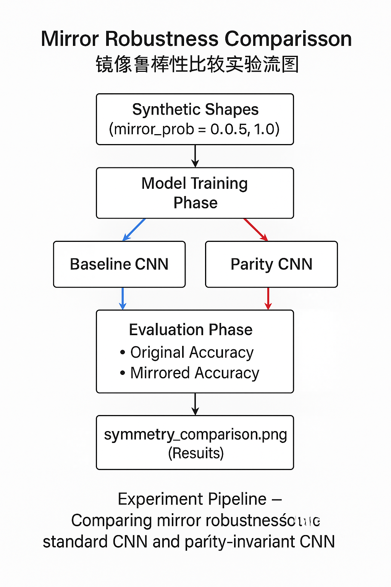
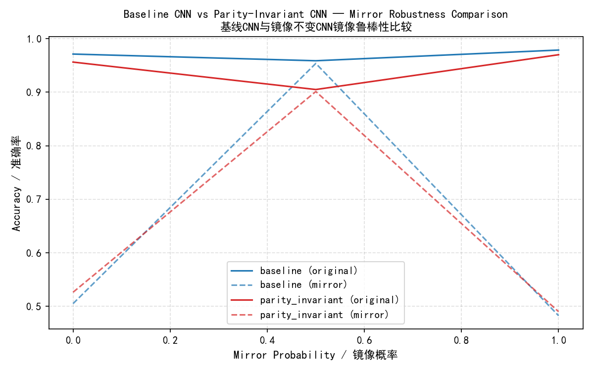

# ParityGEquivCNN 
Learning from Parity: Mirror-Equivariant CNNs with Layer-wise Analysis  

---

## 🌐 Overview 

ParityGEquivCNN explores how convolutional networks can learn mirror (parity) symmetry intrinsically, achieving structural robustness without data augmentation.  
ParityGEquivCNN 研究卷积网络如何在结构上学习镜像（宇称）对称性，从而在不依赖数据增强的情况下实现结构鲁棒性。
---

##  Structure
```
ParityGEquivCNN/
 ├── models/                    # CNNBaseline / ParityInvariantCNN
 ├── utils/                     # data, training, hooks, plotting
 ├── train/
 │    └── run_experiment.py     # train & export weights to outputs/
 │    └── experiment_compare_symmetry.py     # symmetry robustness comparison experiments
 ├── analyze/
 │    ├── analyze_baseline.py   # single-model mirror sensitivity
 │    └── analyze_compare_models.py # baseline vs parity-invariant
 ├── outputs/                   # weights + figures + csv
 ├── docs/figures/              # put cover images / schematics
 ├── requirements.txt
 └── README.md
```


---

##  Quick Start
```bash
pip install -r requirements.txt

# 1) Train models and export weights
python train/run_experiment.py

# 2) Analyze layer-wise mirror response
python analyze/analyze_baseline.py

# 3) Compare baseline vs parity-invariant
python analyze/analyze_compare_models.py

# 4) Run symmetry robustness comparison experiments
python -m train.experiment_compare_symmetry

```

Outputs will appear in `outputs/`:
```
outputs/
 ├── baseline.pth, parity_invariant.pth
 ├── results.txt, results_baseline.csv, results_compare.csv
 ├── feature_maps/
 ├── baseline_corr.png, *_equiv.png
 ├── symmetry_comparision_**.png, .csv
├── symmetry_comparision_**.csv
```

---

##  Method — Parity-Invariant Block
```
phi(x) = 0.5 * [ Conv(x) + mirror_back(Conv(mirror(x))) ]
```
Enforces **Z₂** mirror equivariance **layer-wise** (structure, not just augmentation).


---

##  Expected Results ()
```
Baseline: acc=0.958, acc_mirror=0.466
ParityInvariant: acc=0.970, acc_mirror=0.506
```
And in analysis:
- **Baseline**: low `corr_raw` & low `corr_equiv` across layers.  
- **Parity-Invariant**: `corr_equiv` notably higher than `corr_raw`.

```
mirror_prob,model,acc_original,acc_mirror
0.0,baseline,0.97125,0.505
0.0,parity_invariant,0.95625,0.52625
0.5,baseline,0.95875,0.95375
0.5,parity_invariant,0.905,0.90125
1.0,baseline,0.97875,0.4825
1.0,parity_invariant,0.97,0.49

```

---


📈 Results Analysis / 实验结果分析

 

 

| Region | Phenomenon | Description |
| ----------------------- | ---------------------------- | ---------------------------------------------- |
| **Left (mirror_prob=0.0)** | Baseline is not robust to mirroring, while ParityCNN is stable | Without mirrored samples, the standard CNN fails to generalize; the structural model remains stable. |
| **Middle (mirror_prob=0.5)** | The performance of the two approaches is similar | When the data contains some mirrored samples, Baseline learns empirical symmetry; ParityCNN maintains structural equivariance. |
| **Right (mirror_prob=1.0)** | The performance of the two approaches is similar and slightly degrades | With fully mirrored data, the task degenerates into symmetric learning, and generalization is slightly degraded.


| 区域                      | 现象                           | 说明                                             |
| ----------------------- | ---------------------------- | ---------------------------------------------- |
| **左端（mirror_prob=0.0）** | Baseline 对镜像不鲁棒，ParityCNN 稳定 | 无镜像样本时，普通 CNN 无法泛化；结构性模型保持稳定。                  |
| **中间（mirror_prob=0.5）** | 两者性能接近                       | 数据中包含部分镜像样本时，Baseline 学到经验对称；ParityCNN 保持结构等变。 |
| **右端（mirror_prob=1.0）** | 两者性能接近且略降                    | 完全镜像数据下，任务退化为对称学习，泛化略降。                        |

---

##  References papers
- Cohen & Welling (2016) — Group Equivariant CNNs  
- Weiler & Cesa (2019) — General E(2)-Steerable CNNs

## License
MIT
